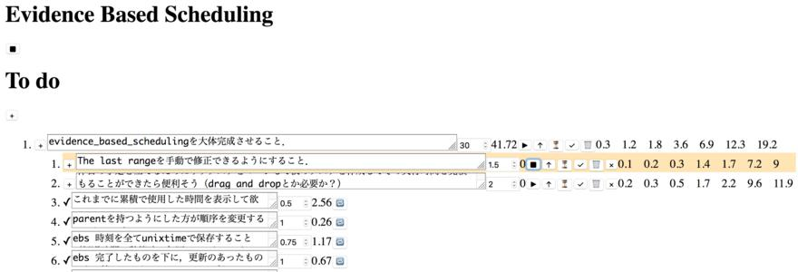

# Evidence Based Scheduling

[](https://travis-ci.com/kshramt/evidence_based_scheduling)

This is a TODO application, which supports [the evidence based scheduling](https://www.joelonsoftware.com/2007/10/26/evidence-based-scheduling/).


The numbers on the right show 0th, 10th, 33th, 50th, 67th, 90th, and 100th percentiles of the estimated time to complete in hours.

## Usage

```
./build.sh
docker run --rm -p 5000:5000 -v "$(pwd)":/app/data kshramt/evidence_based_scheduling
# open localhost:5000 in a Web browser
```

## Development

```
python3 -m  venv venv
source venv/bin/activate
pip3 install -r requirements.txt
npm ci

EBS_DATA_DIR=. FLASK_APP=server.py FLASK_DEBUG=1 flask run
# On another terminal window.
npm start # http://localhost:3000
```

## License

GNU General Public License version 3.
